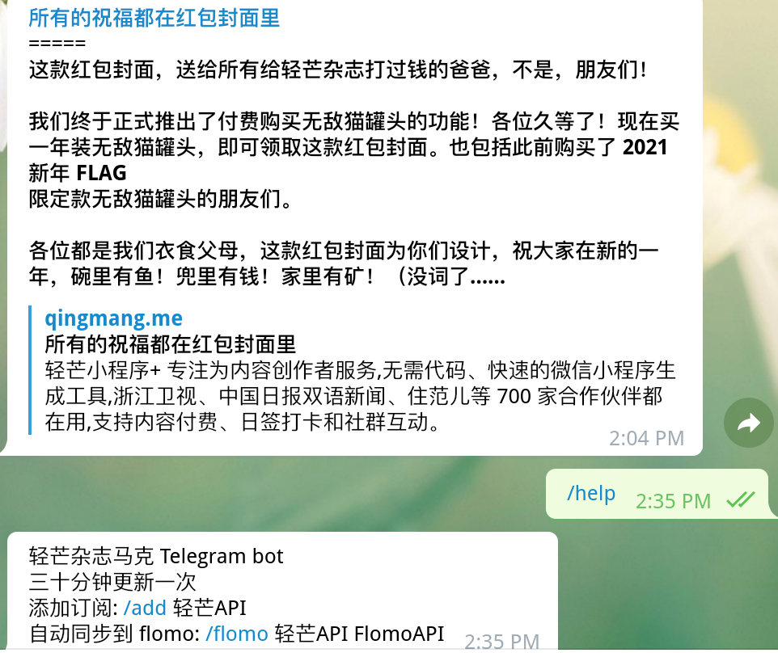

# 轻芒杂志 马克内容自动同步

解析轻芒杂志-马克文章、内容及笔记 API, 定时同步到其他平台。

API 示例: https://qingmang.me/users/11/feed/

## 新版本
Telegram BOT 暂不可用，更容易的到同步 FLOMO
[查看文档及使用](https://github.com/dake0805/Qingmang-mark/tree/flomo_only)

## 环境

`python 3`

## Telegram BOT

定时由 Telegram BOT 把新的马克内容发送到 Telegram 消息。

## FLOMO

同步到 Flomo 在当前版本需要配置 Telegram BOT

启用 Telegram BOT 后，输入命令 `/flomo 轻芒API FlomoAPI`，注册到任务队列。

## 部署使用

TODO

## 配置

程序相关配置主要位于 `config.py`

- `token`: Telegram BOT 的 token，在 `tg@BotFather `处申请 BOT 后获得。
- `REQUEST_KWARGS = { 'proxy_url': 'http://127.0.0.1:7890/',}` 设置用于与 Telegram 通信的代理。（只有 Telegram 使用这里设置的代理）
- `delay`: 每次查询轻芒 API 新内容的间隔时间，单位秒。
- `message_template`: 可自定义消息的格式

## 已知 bug

